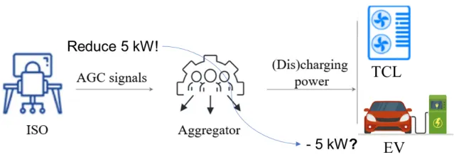
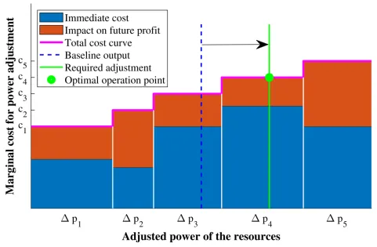

## Research Background

This research was inspired by a simple thought experiment: Imagine you operate a virtual power plant (VPP) that aggregates an air conditioner and an electric vehicle to provide ancillary services to the grid. You normally use electricity as needed, but when the grid wants you to adjust, you need to change your overall power consumption according to grid instructions. The grid then compensates you for helping achieve supply-demand balance at a lower cost.

At a certain time period, suppose you're using electricity normally: the air conditioner is consuming 5kW (rated power 10kW), and the electric vehicle is plugged in but neither charging nor discharging (power range ±5kW). You'll find that your total upward regulation capacity (reducing consumption) is 5+5=10kW, and your total downward regulation capacity (increasing consumption) is also 5+5=10kW. Obviously, both the air conditioner and the electric vehicle each provide 5kW of regulation capacity. Now, if the grid asks you to adjust upward by 5kW (Figure 1: reduce power consumption by 5kW), how would you control the air conditioner and electric vehicle?

## Key Challenges

The initial strategy of "prioritize turning off the air conditioner" might seem optimal, but several issues need consideration:

1. **Uncertainty of grid instructions**: Typical ancillary services like peak regulation, frequency regulation, and reserves have unpredictable grid instructions with multiple possible scenarios.

2. **Temporal coupling in VPP operation**: The operation strategy should maximize the VPP's total profit over the entire time window (e.g., next 24 hours), while state variables like indoor temperature and EV battery energy have temporal coupling characteristics.

3. **Second-level control of massive heterogeneous resources**: In reality, a VPP might aggregate tens of thousands of resources with different characteristics, while services like secondary frequency regulation require second-level response.

The challenge lies in considering both the randomness of grid instructions and the multi-period coupling of VPP benefits to achieve online disaggregation of regulation instructions among massive heterogeneous resources.

## Solution Method

Our method uses the shadow prices of resource state variables in the original problem to achieve temporal decoupling. It consists of three steps:

1. **Construct optimal VPP operation strategy**: Before each day or hour, solve the original problem with all factors considered to determine the VPP's optimal hourly bidding and power disaggregation results. Crucially, preserve the shadow prices of all resource state variables.

2. **Simplify to optimal disaggregation strategy**: Use the physical meaning of shadow prices to decouple the online control problem temporally, transforming it into a linear program that only considers the current period and current regulation instruction.

3. **Fast disaggregation algorithm**: Further leverage the problem structure to develop a fast disaggregation algorithm using only algebraic operations to solve for the optimal disaggregation results.

The fast disaggregation algorithm works in two steps: First, based on each resource's regulation cost and shadow prices of state variables, calculate the marginal adjustment cost for each resource. Then, within the feasible regulation range of resources, adjust from low-cost resources until the required adjustment amount is reached.

## Numerical Results

Using real market prices and RegD signals from PJM in the US, we tested the operating profits of VPPs under different operation strategies:

1. **Proportional Disaggregation** (commonly used in existing literature)
2. **Greedy Disaggregation** (always using resources with the lowest immediate cost)
3. **Our Optimal Disaggregation** method (considering grid instruction uncertainty and temporal coupling)

Results show that our method significantly improves VPP net profit. Interestingly, the "prioritize turning off the air conditioner" strategy performed worst because it doesn't consider how current control strategies affect future VPP profits.

We also tested the computation time of different algorithms as the number of distributed resources increases. With over 10,000 resources:

1. **Original optimal operation strategy**: Solving time exceeds several minutes
2. **Optimal disaggregation strategy**: Solving time at second level
3. **Fast disaggregation algorithm**: Solving time at millisecond level, involving only algebraic operations

## Method Advantages

Our approach for VPPs aggregating massive heterogeneous resources to interact with the grid offers the following advantages:

1. Significantly improves VPP operating profits compared to traditional proportional disaggregation and greedy strategies

2. Uses shadow prices to achieve temporal decoupling, transforming the original large-scale optimization problem into an equivalent small-scale optimization problem

3. Achieves millisecond-level precise control of over 10,000 resources using only basic arithmetic operations

## Resources

- Author Contact: lvruike1999@163.com
- Author Website: [https://www.researchgate.net/profile/Ruike_Lyu](https://www.researchgate.net/profile/Ruike_Lyu)
- Data and Code: [https://github.com/Rick10119/Real-time-operation-strategy-of-virtual-power-plants](https://github.com/Rick10119/Real-time-operation-strategy-of-virtual-power-plants)
- Original Chinese Article: [清华电机系公众号文章](https://mp.weixin.qq.com/s/735kxKLqd2lvPHmqsqO9oA)

