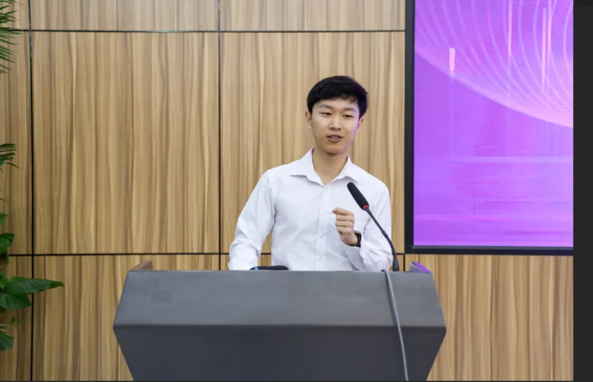

# We Always Need Courage to Live: Reflections on Starting Graduate Study

*The following is a translation of a speech given by Ruike Lyu at the 2024 Graduate Student Opening Ceremony of the Department of Electrical Engineering, Tsinghua University.*

## Embracing Your New Identity

Dear fellow students and respected professors,

Good morning! I'm Ruike Lyu, a fourth-year PhD student in the Department of Electrical Engineering. It's my honor to represent current graduate students in welcoming all new students to our department!

Actually, I should say "welcome to all new freshmen," because not everyone here is entirely new – some of you graduated from our department as undergraduates in 2020. You're all equally welcome!

Why do I emphasize that while not all of you are new students, you are all freshmen? Think about this: if you, as a senior undergraduate, were to speak at a freshman orientation, what would you most want to say? Those freshmen just emerged triumphant from the gauntlet of college entrance exams, confident in their knowledge. But after four years of university education, you know that the depth of high school knowledge simply can't compare with undergraduate studies. You would tell them to transform their thinking approach and not apply high school thinking to university learning.

Similarly, all of you here have mastered China's undergraduate education system. That's wonderful, and when you face setbacks in the future, remember that you were once extraordinary – or at least, you once were. But what I want to emphasize is that you need to set aside your past and accept your identity as freshmen, because in the coming month, year, three years, five years, or even eight years, you will inevitably encounter unfamiliar and unknown situations that require you to explore, make mistakes, and experience failure.

## Finding Courage in Graduate School

Is there any method or secret I can share as a current graduate student to help you navigate the new knowledge and problems you'll face? Before coming here, I conducted a literature review and found that in recent years, current student representatives have shared advice on advisor-student relationships, time management, reducing internal friction, and addressing research challenges – all published on the THU EE Graduate Student WeChat account. After reading these, I felt nervous because I thought existing research was already comprehensive, making it difficult for me to propose new models or methods, or even offer a fresh perspective. So I decided to share an empirical analysis today – that is, to tell my own story.

I'm a fan of Eason Chan. Is anyone else here a fan? Even if you're not, you might still connect with what I'm about to share. Based on taking the college entrance exam in 2020, many of you were born in 2002. That year, Eason Chan released a song called "This Day Next Year." You might not know this song, but you've definitely heard its Mandarin version, "Ten Years." My speech today is inspired by a lyric from "This Day Next Year" – "People always need courage to live."

I love this lyric, especially the word "always." In the dictionary, "always" here means "certainly, no matter what." Why "always"? Because as living human beings, we naturally prefer familiarity and fear the strange and unknown – an evolutionary trait from ancient times. But we also know that we must step outside our comfort zones to learn new things and escape local optima.

This presents a dialectical problem: the more comfort we seek, the more we lose opportunities to understand the world and improve ourselves, ultimately becoming less comfortable. Coming to study at the EE Department, you certainly don't want to graduate in a few years with the same understanding and thinking ability you have now. So my point is that during graduate studies, we need to continuously step outside our comfort zones. Because no matter how we navigate life's twists and turns, we always need the courage to face things that initially feel uncomfortable.

## Developing Essential Courage

The most important courage is discovering your own problems through others. I emphasize "through others" because I believe you've probably already resolved most problems you could identify yourself. I remember writing my first academic paper during my first doctoral semester, attending classes during the day and writing late into the night at the lab.

At that time, all the research work was completed, and only the English writing remained. I wrote for three hours every day for a month – quite committed, right? But my English writing skills weren't good, so I couldn't write much each day. Most of my time was spent revising what I'd already written, then squeezing out a few more lines like toothpaste. Because I looked at it every day, it seemed increasingly coherent, and I became self-satisfied. After a month, I finished the draft, thought it was perfect, and confidently sent it to my advisor. I thought he might make some minor edits before submission. The next day, I clearly remember eating at Guanchao Cafeteria when my phone vibrated – my advisor had sent 15 sixty-second voice messages. I immediately knew there were many problems, but I dared not listen to the messages. I felt chilled, my heart raced, and I couldn't eat because the gap between expectation and reality was too great. I walked around the West Sports Field two or three times before daring to convert the voice messages to text, as I still couldn't bear to listen. That night I couldn't work properly, and only began addressing my advisor's comments the next day – essentially rewriting the paper.

That was the first revision of my first paper. In total, I went through 10 iterations with my advisor before submission. Some say doctoral studies are like a magnifying glass, because your various issues will be identified by people much more capable than you – advisors, reviewers, degree committees, international conference attendees, and more. At first, this is truly painful, but pain brings the most growth. Without my advisor's 15 voice messages and 10 revisions, I would still be lost in my self-delusion, and my paper would never have been published. So I encourage you not to assume perfection like I did, but to acknowledge your limitations and embrace problems – that's the direction of progress.

The second courage is taking the first step. Let's take a poll: who believes large-scale energy storage is impossible? When I was an undergraduate, professors taught us that large-scale energy storage was economically unfeasible. Why is it feasible now? Because of the learning curve. When a product first appears, it's expensive, but costs decrease rapidly with technological advances and production experience. Research works the same way – the first step is always the most difficult, least economical, and most error-prone.

My first doctoral research project involved identifying industrial production line parameters based on electricity meter data, with almost no directly relevant literature. My advisor said, "Study it yourself first." So I went to the library every day, reading papers during the day and deriving formulas at night. I worked hard but made no headway because this was a completely unfamiliar direction where I had to learn even the terminology from scratch, so progress was slow. After three months, I began to worry but didn't say anything because I'd been taught that research requires "ten years to forge a sword," and I'd only been at it for three months – not very long. So I kept quiet, but my advisor keenly sensed my problem and told me four words: "Good things take time." So I continued.

Later, when even my advisor couldn't bear it any longer, he said: "I have an idea, try this." He shared his idea, and I suddenly felt enlightened – why hadn't I thought of that? I went back, diligently derived formulas and programmed for weeks, only to discover that the idea, which seemed reasonable at first glance, simply wouldn't work for industrial users. So I took my formulas and calculations to my advisor and said, "Professor, your idea might work for power generation entities, but for industrial users, there are these problems. I've thought of these possible solution paths."

As soon as I finished speaking, I laughed, because I realized my advisor had just given me a random idea to push me to take the first step. Later, none of the paths I'd considered succeeded, but after multiple attempts, I finally proposed a successful method. So, only by actually doing something and gaining deeper understanding of the problem can you discover solutions and gradually achieve results. It's like crossing a river by feeling for stones – you don't know which path leads to the other shore, so you must take one step, then feel for the next. If you want to stand on the shore and first investigate the river's entire history – when it formed, which wars it witnessed, which scholars have studied it – then you truly should prepare for that ten-year sword-forging. But remember, even with extensions, a doctoral program lasts at most eight years.

## Conclusion

New students, your learning ability is unquestionable – you've proven yourselves by entering this world-class platform at Tsinghua University's Department of Electrical Engineering. But just as you would tell undergraduate freshmen, I want to tell you to adjust your mindset, consider yourselves freshmen, and embrace the unknown and challenges ahead. Have the courage to face your own problems and take the first step. Because "people always need courage to live!"

Thank you!

---

*Original Chinese version of this speech is available at: [THU EE Graduate Student WeChat](https://mp.weixin.qq.com/s/9W4TiRvHkm7IdwUMbVx9sA)*

