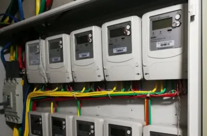

# Using Smart Meter Data to Build Digital Twin Models of Industrial Loads

## Research Background

This research originated from an industry need: before implementing large-scale demand response programs, grid operators want to know which users can adjust their power consumption and by how much. This requires building a database of control capabilities, but manual inspections lack objectivity and real-time accuracy. Is there an automated assessment method?

You might have seen smart meters like the one in Figure 1 near your home's entrance or apartment building. These meters record each user's total electricity consumption, typically hourly (or every 15 minutes), and can transmit data to the utility company in real time. Is it possible to use smart meter data to reverse-engineer information about what's happening inside a facility?

Smart meter data has already found numerous applications. For example, analyzing electricity usage patterns can reveal household composition: if electricity usage significantly decreases after 10 PM every night, the home likely has no young people. However, most analyses only apply simple machine learning algorithms like classification or clustering, and their capabilities remain limited—they cannot accurately obtain information about the user's internal electrical equipment.

Non-intrusive load monitoring (NILM) technology can be used to obtain information about internal electrical equipment using total meter data. NILM decomposes the user's total meter data into data for each electrical device, which can be used to preliminarily assess the user's response capability. However, NILM typically requires high-frequency data collection, at least once per minute—far exceeding the hourly smart meter data collection and storage frequency.

In summary, although smart meter data may be the grid's most convenient channel for obtaining information about power users' energy usage, existing research has not yet achieved accurate modeling of users using smart meter data—this is the issue we want to explore in this paper. In particular, we focus on energy-intensive industrial users, such as cement and metallurgical industries, because they have greater regulation potential, mature control methods, and are more sensitive to incentive measures.

Specifically, our goal is to build digital twin models of industrial users' energy usage solely using smart meter data. Here, the concept of "digital twin" has three levels:

1. **Physical Layer**: The data foundation of the digital twin. Hourly energy curves of the entire factory are collected through smart meters and uploaded in real time.

2. **Digital Layer**: The core of the digital twin. First, a mathematical model of industrial user energy usage is established based on energy mechanisms; then, model parameters are inversely deduced based on smart meter data collected in the physical layer. The parameterized model reflects the state, behavior, and performance of factory equipment in the real world.

3. **Cognitive Layer**: The intelligent part of the digital twin. The model and data from the digital layer are used for analysis, decision-making, and optimization of user energy conservation, carbon reduction, and participation in demand-side response.

## Problem Description

To build a digital twin model of industrial user energy usage, our core focus is data. The key question is how to build an energy usage model without access to internal industrial user data. Specifically, we focus on the production process, which accounts for the majority of industrial users' energy consumption. The data required for modeling can be divided into specific parameters of industrial facilities (private) and prior knowledge of the production process (public):

**Specific parameters of industrial facilities** refer to internal information such as the equipment composition of the factory, including the rated power of equipment at each production stage, material storage space, production targets, and other parameters. These parameters involve the privacy of industrial users, and we believe external entities cannot directly access them.

**Prior knowledge of the production process** refers to information that can be obtained through public channels such as the internet and expert knowledge, and is independent of the specific parameters inside the factory. The processes for typical energy-intensive industries like steelmaking, cement production, and aluminum electrolysis are relatively mature, with national standards or industry reports for reference on the unit energy consumption at each stage. Some enterprises even voluntarily disclose production process information. For example, the grid can easily know from user records that a factory is a cement plant, and without entering the factory for investigation or installing meters, it can know the production process and the amount of electricity and raw materials needed to produce a ton of (intermediate) product.

In addition to the above data related to factory production processes, we also assume that the hourly electricity prices faced by industrial users and corresponding smart meter data from the past are known. The problem to be solved is how to use the historical price-energy consumption dataset to reverse-engineer the load model, whose parameters include the specific equipment parameters to be determined and prior knowledge of the production process.

## Solution Method

We use data-driven inverse optimization to identify production line parameters.

Our method is primarily based on two assumptions: First, we assume that industrial users optimize their production arrangements in response to fluctuating electricity prices to minimize energy costs. Second, we assume that the industrial production process being studied can be modeled using a standardized production line model. The chosen State-Task Network (STN) is a standardized production line model that balances expressivity and complexity, and has been widely used to model industries such as cement plants, steel powder manufacturing plants, and lithium battery plants. Therefore, we assume that the user uses STN to model its production process and optimizes its energy usage accordingly.

Under these assumptions, the problem is transformed into: If an industrial user's smart meter data is based on the optimal energy usage results of an STN model (with parameters θ) under electricity prices, how can we use smart meter data to reverse-engineer θ? This constitutes an inverse optimization problem (optimization problem: known problem parameters, seeking optimal solution; inverse optimization: known optimal solution and partial parameters, seeking remaining parameters). Our solution method consists of three steps:

a) First, considering that the binary variables in the STN model make it difficult to express the optimality conditions of the original problem in inverse optimization, we improve the STN model, including linearization, allowing production task aggregation, and using normalized parameters;

b) Second, based on the improved STN model, we construct an inverse optimization problem using smart meter data, including designing a loss function to measure the fit between the load model with parameters θ and the actual meter data;

c) Finally, we design an algorithm to optimize θ to minimize the loss function. To use more data while controlling computational complexity, we construct an iterative algorithm based on zeroth-order stochastic gradient descent to use price-energy data from different dates.

**Production Scheduling Identification (PSI) Concept**: The model identification process of PSI (b) is inspired by machine learning (a). Both train a model with optimal parameters based on historical data, but the model-free assumption in machine learning is replaced by a production scheduling problem based on production line energy mechanisms (in the mathematical form of improved STN) in PSI. Therefore, PSI is a data-driven framework that integrates domain knowledge—this is the biggest difference between PSI and purely data-driven methods, and the key to its ability to achieve accurate industrial load modeling using coarse-grained smart meter data.

**Model Usage**: Once we solve for the load parameters θ, we simultaneously obtain the factory's production energy model in the form of an improved mSTN. This model can be used to estimate the demand response capacity of industrial facilities, or be embedded in economic dispatch, market clearing, or bidding models. As a simplified but intuitive application, virtual power plants can use the load model to estimate changes in users' hourly electricity consumption under given incentives. Another application is baseline load estimation, which estimates the original load a user would have had without incentives after demand response.

## Numerical Test Results

Tests were conducted on datasets generated based on real industrial production line parameters from cement plants and steel powder plants and PJM historical electricity prices (21 days of hourly electricity consumption and price data). The main results are as follows:

a) **Parameter Identification Accuracy**: The proposed method can identify the parameters of a factory's production process model with high accuracy (Table 1) (including: rated power of each production stage, storage upper and lower limits, production targets, etc.). Some parameters had larger discrepancies with true values, possibly because the energy constraints corresponding to those parameters did not actually take effect.

b) **Load Model Performance**: Given different electricity prices, based on the identified factory energy model, it can accurately simulate the factory's response to electricity prices (using the output of the model based on real parameters as the ground truth), achieving significantly higher model accuracy than machine learning methods (Figure 5). The cement plant has only 4 main production stages, while the steel powder plant has 10 production stages, so the parameter identification process for the cement plant has lower computational complexity, resulting in a lower model error (5.5%) than the steel powder plant (8.7%). The PSI method has more than 50% lower error than black-box models on both datasets.

## Conclusion

In this paper, we studied the problem of industrial user energy modeling under incomplete information and proposed the PSI framework that uses only smart meter data to achieve industrial load modeling. The advantages of the proposed method are as follows:

1. It does not require any internal parameters of the factory and builds an industrial load model using only hourly smart meter data and prior knowledge;

2. Due to the embedded industrial production line energy mechanisms in the PSI framework, it achieves far higher model accuracy than purely data-driven methods.

The end result is that using only smart meter data, we have built a digital twin model of industrial users' production energy consumption, which can enable automated establishment of a database of industrial users' control capabilities, supporting the digital and intelligent implementation of demand-side response.

## Resources

- Author Contact: lvruike1999@163.com
- Author Website: [https://www.researchgate.net/profile/Ruike_Lyu](https://www.researchgate.net/profile/Ruike_Lyu)
- Original Paper: [https://ieeexplore.ieee.org/document/10769532](https://ieeexplore.ieee.org/document/10769532)
- Code Repository: [https://github.com/Rick10119/Production-Scheduling-Identification](https://github.com/Rick10119/Production-Scheduling-Identification)
- Original Chinese Article: [THU EE Graduate Student WeChat](https://mp.weixin.qq.com/s/IjdVvfSPOiGMnlqVt3U8tg)

**Citation Format:**
R. Lyu, H. Guo, Q. Tang, Q. Chen and C. Kang, "Production Scheduling Identification: An Inverse Optimization Approach for Industrial Load Modeling Using Smart Meter Data," in IEEE Transactions on Smart Grid, doi: 10.1109/TSG.2024.3507046.

