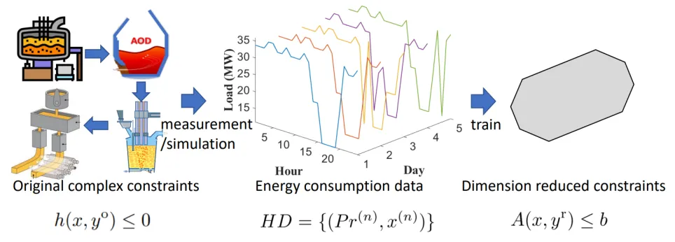
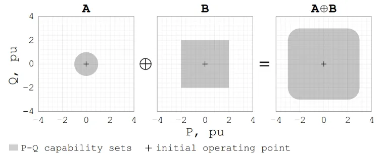

# How to Approximate High-Dimensional Non-Convex Feasible Regions with Low-Dimensional Linear Constraints

## Research Background

When solving optimization problems, a fundamental principle is that simpler constraint forms (convex or linear) and lower dimensions typically result in faster solution times for the same objective function. Even in today's era of advanced computing power, simplifications of generator or power grid models are still necessary to complete economic dispatch or market clearing within required timeframes. This represents a trade-off between model accuracy and computational feasibility.

In the future, with massive demand-side resources participating in source-load interactions, economic dispatch may need to incorporate demand-side resources several orders of magnitude greater than existing generator units. These resources (such as industrial production lines) may have more integer variables and nonlinear relationships, making constraint simplification even more critical. Depending on the scenario, this simplification may take the form of "aggregation," "dimension reduction," "relaxation," "linearization," etc., but essentially all address the same question: How can we replace complex constraints with more computationally tractable ones while keeping errors within acceptable limits? For convenience, we'll use "dimension reduction" to refer to this problem.

Ideally, dimension reduction would use a lower-dimensional constraint to completely capture the original constraint. Mathematically, this is a projection problem or Minkowski sum (the sum of two sets). However, this approach has a fatal flaw: computing exact dimension reduction constraints is extremely complex (NP-hard). Figure 1 provides a visual explanation: Sets A and B can be easily represented—set A with a center and radius, set B with a few linear constraints. But analytically representing the sum of sets A and B is challenging. This is a simple case; for complex constraints, no computationally feasible algorithms exist.

Since exact dimension reduction is computationally intractable, existing methods primarily use computationally feasible approaches to approximate original constraints, such as inner approximation and outer approximation, both maintaining a simple rectangular constraint shape with parameters that can be relatively easily calculated from the original parameters of A and B. We call these analytical methods, characterized by using the mathematical form and parameters of the original constraints to derive dimension reduction constraints based on certain derivations and assumptions.

However, analytical constraint dimension reduction methods have significant limitations:

1. **Limited adaptability**: Analytical methods depend on the mathematical forms of the original and reduced constraints. If the original constraint form changes, the method may need manual modification.

2. **Uncontrollable errors**: Taking inner approximation as an example, it requires the feasible region of the reduced dimension constraint to be inside the original constraint's feasible region. If set A's radius is large in our example, the error from rectangular approximation would be substantial.

3. **Most importantly**, existing approximation methods (especially aggregation methods) require the original constraints to be convex, are incompatible with integer variables, and cannot accommodate demand-side resources like industrial production lines with numerous integer variables.

In this paper, we explore a completely different approach from analytical methods, proposing a data-driven constraint dimension reduction method. The main idea is not to directly obtain the form and parameters of the original constraints, but to obtain optimal solutions to optimization problems based on the original constraints (historical optimal solutions or simulated optimal solutions), treat them as optimal solutions to optimization problems based on dimension-reduced constraints, and use inverse optimization techniques to reverse-engineer the constraints. Our method does not depend on the form of the original constraints, thus having stronger adaptability and compatibility with constraints containing integer variables. The code is open-sourced (see link at the end). Below, we introduce the main methods and results using industrial load modeling as an example.

## Problem Description

Without loss of generality, our goal is to use a set of low-dimensional linear constraints Ax≤b to approximate the original high-dimensional complex constraints h(x, y)≤0 (original energy consumption constraints of industrial processes). If we require strict equivalence between the reduced and original constraints, this becomes a projection of the variable space corresponding to the original constraints onto the reduced constraints. However, strict projection may be computationally infeasible when the original constraints have high dimensions, integer variables, and time coupling. Moreover, in current source-load interactions, small deviations in demand-side response are acceptable. Considering these practical factors, we relax the conditions of strict projection and instead introduce a loss function to describe the error of the reduced constraints relative to the original ones.

Thus, our goal becomes determining appropriate parameter matrix A and vector b to minimize the approximation error. Specifically, rather than analytically deriving A and b based on the form and parameters of the original constraints h(·), we observe the historical energy usage of industrial users and fit A and b in a data-driven manner. In doing so, we assume we have historical energy usage data of industrial users who optimized their energy costs based on original constraints in the face of historical boundary conditions (fluctuating external electricity prices). This may be real historical data or simulated data. In either case, we do not directly use h(·), meaning the calculation process can be performed by entities other than the industrial user without needing to obtain their internal parameters, providing the additional benefit of privacy protection.

Under these assumptions, the approximation error can be represented as the distance between the optimal energy usage given by the original constraints and the reduced constraints under historical electricity prices. This serves as the objective function for fitting the reduced constraints, with the KKT conditions of the optimization problem constrained by A(x,y)≤b as constraints. Below, we introduce the specific problem formulation and solution method.

## Solution Method

Using data-driven inverse optimization to solve for optimal dimension reduction constraint parameters.

In principle, we could search for appropriate matrix sizes and element values in the entire space of A/b through inverse optimization. However, the high-dimensional search space and high-dimensional nonlinear constraints in the inverse optimization problem's optimality conditions (due to potentially using multi-day data) might make computational costs unacceptable. Our solution approach is twofold: First, select an appropriate form of parameter matrix based on industrial user energy usage characteristics (adjustable load clusters); then, design a solution algorithm based on zeroth-order stochastic gradient descent to iteratively solve the inverse optimization, and reduce the computational complexity of each iteration through optimality condition transformation (Fortuny-Amat transformation).

We chose an adjustable load cluster as the form of low-dimensional linear constraints to fit, mainly for two reasons: First, in common general models such as the State-Task Network (STN) and Resource-Task Network (RTN) developed from it, common industrial process characteristics like production goal constraints and equipment composition relationships can be well captured by a cluster of multiple adjustable loads; second, the adjustable load cluster model is a commonly used load model in power systems, with low computational complexity and compatibility with existing models such as economic dispatch.

## Numerical Test Results

We tested the proposed Data-Driven Dimension Reduction (D3R) method on three datasets: a cement plant, a steel powder manufacturing plant, and an ironmaking plant. The first two were modeled with STN models, while the ironmaking plant was modeled with an RTN model—all typical models with high-dimensional constraints and integer variables. For these complex models, there are no mature dimension reduction or projection methods that consider multi-period coupling, so we compared D3R with a simple adjustable load model (SAL) and an optimal virtual battery model (OVB) based on inner approximation.

Results show that D3R achieved the best performance across all three datasets, meaning the reduced constraints obtained by this method gave optimal energy usage results with the lowest NRMSE compared to results based on original constraints in the test set. The OVB method based on analytical inner approximation performed much worse and is not applicable to dimension reduction of constraints with integer variables.

## Conclusion

Unlike traditional analytical constraint dimension reduction approaches based on constraint forms and parameters, we propose directly using optimal solutions to optimization problems based on original complex constraints to train low-dimensional linear constraints that best fit the original constraints. In the scenario of industrial load modeling, we preliminarily validated this idea's feasibility using an adjustable load model with parameters fitted based on inverse optimization. The proposed method outperformed other comparison methods on three industrial load datasets. Our research provides a novel approach to solving complex constraint dimension reduction and approximation involving integer variables.

## Resources

- Author Contact: lvruike1999@163.com
- Author Website: [https://www.researchgate.net/profile/Ruike_Lyu](https://www.researchgate.net/profile/Ruike_Lyu)
- Data and Code: [https://github.com/Rick10119/Data-Driven-Dimension-Reduction](https://github.com/Rick10119/Data-Driven-Dimension-Reduction)
- Original Paper: [https://ieeexplore.ieee.org/document/10902053](https://ieeexplore.ieee.org/document/10902053)
- Original Chinese Article: [THU EE Graduate Student WeChat](https://mp.weixin.qq.com/s/L-_tr6lyHOflz5IsfBJK2A)

**Citation Format:**
R. Lyu, H. Guo, G. Strbac and C. Kang, "Data-Driven Dimension Reduction for Industrial Load Modeling Using Inverse Optimization," in IEEE Transactions on Smart Grid, doi: 10.1109/TSG.2025.3545339.

