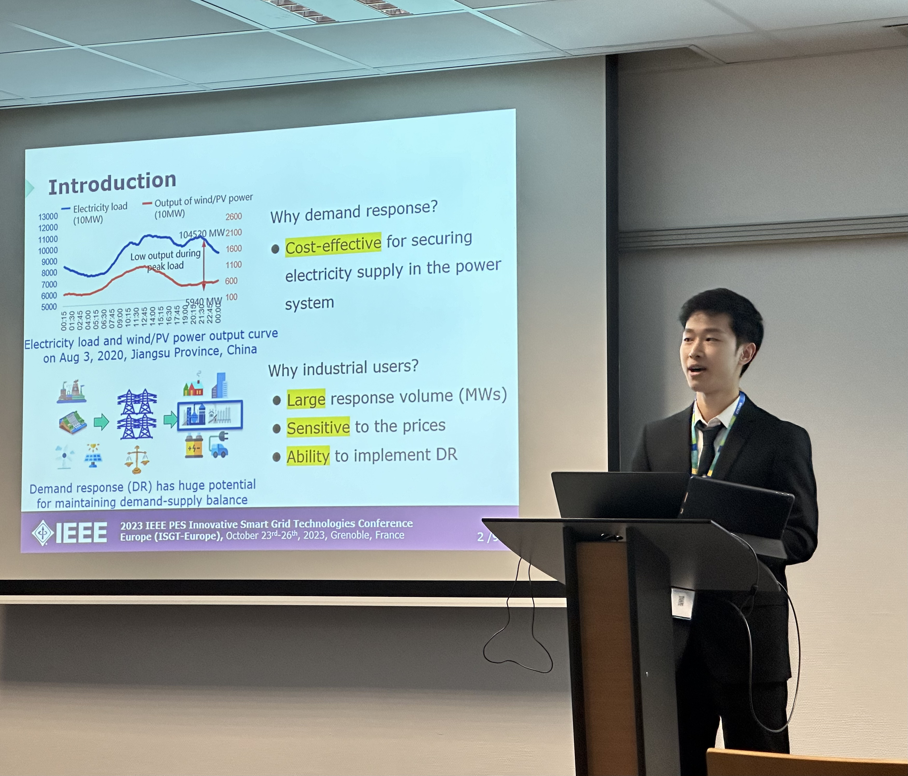

 <!-- Add your photo here -->

## Conference Information

The 2023 IEEE PES Innovative Smart Grid Technologies Europe (ISGT Europe) conference was held in Grenoble, France, focusing on "Powering solutions for decarbonized and resilient future smartgrids."

## Presentation Summary

In this presentation, I introduced LSTN (Linear State-Task Network), a novel approach for modeling industrial production processes in demand response applications. The model significantly improves computational efficiency while maintaining modeling accuracy, making it practical for large-scale industrial demand response programs.

## Key Points

- Industrial users can provide valuable flexibility to power systems through demand response
- Traditional models use many binary variables, making them computationally expensive
- LSTN uses continuous variables to represent production tasks and progress
- Our approach reduces computational complexity without sacrificing accuracy
- Tests show faster solving times and better scalability for practical applications

## Overview

Industrial production modeling provides operational constraints for industrial users participating in demand response (DR) programs. Conventional modeling of the production process introduces binary variables to model the discrete operating points of industrial equipment, which can be computationally infeasible in large-scale DR applications. To reasonably model industrial users' operational constraints while balancing computational complexity and modeling accuracy, we developed a linear model of the industrial production process for evaluating DR applications. Numerical results verify the accuracy of the proposed model and its great improvement in computational efficiency over competing approaches.

## Resources

### Conference Website
[2023 IEEE PES ISGT EUROPE](https://attend.ieee.org/isgt-europe-2023/)

### Code, Data and Slides
All materials related to this presentation are available in this GitHub repository:
[Industrial User Modeling Toolkit - LSTN MATLAB](https://github.com/Rick10119/Industrial-User-Modeling-Toolkit/tree/main/LSTN_matlab)