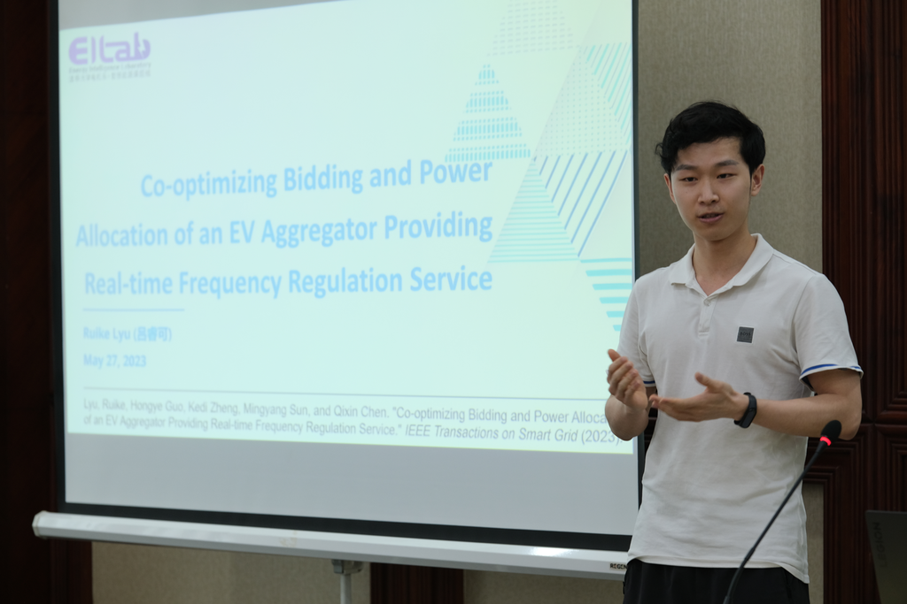

## Forum Information

The "Tsinghua University-IET Electrical Engineering Academic Forum" was held on May 27, 2023, at Dayan Building Hotel in Beijing. The forum theme was "NEW ENERGY SYSTEM SUPPORTING HIGH-QUALITY DEVELOPMENT".

## Presentation

I presented my research on "Co-Optimizing Bidding and Control Methods for Auxiliary Service Market Participation." This study explores how electric vehicle aggregators can optimize their bidding strategies and power allocation in real-time frequency regulation service markets.

## Key Points

- Developed a complete solution for EV aggregators in auxiliary service markets
- Created a mathematical model for joint optimization of bidding and power allocation
- Analyzed uncertainty factors affecting optimal decisions
- Validated the method using real market data

## Resources

 <!-- Add your photo here -->

### Research Code and Data
The code and data for this research are available in this GitHub repository:
[Co-Optimizing Bidding and Power Allocation of an EV Aggregator](https://github.com/Rick10119/Co-Optimizing-Bidding-and-Power-Allocation-of-an-EV-Aggregator)

### News Coverage
For more information about this forum:
[Tsinghua University-IET Electrical Engineering Forum News](https://mp.weixin.qq.com/s/Ct-olayn64cA-EFctAMFuw)