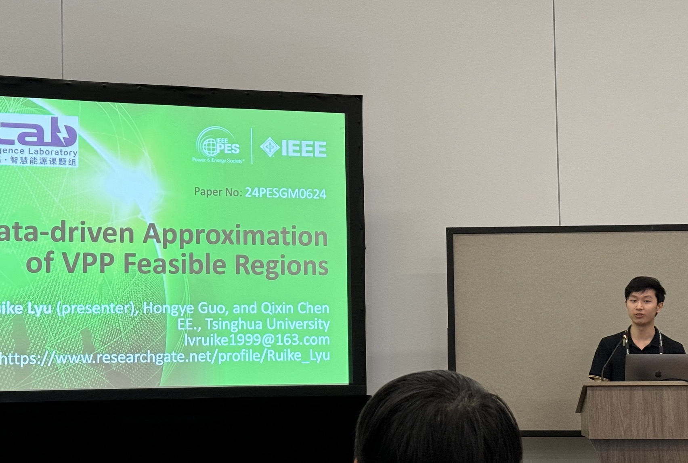

## Conference Information

The 2024 IEEE Power & Energy Society General Meeting was held 21–25 July 2024 in Seattle, Washington. 
The theme of the meeting is: "The New Electric System: Reinvention and Resilience"
In this presentation, I introduce a novel data-driven approach to approximate the feasible region (FR) of virtual power plants (VPPs). This work addresses the challenges of FR aggregation that system operators face when integrating VPPs into electricity markets.

## Key Points

- System operators are beginning to allow VPPs to submit their feasible regions for market clearing
- VPPs need effective methods to aggregate the capabilities of their distributed energy resources
- Traditional analytical approaches face limitations in generality and adaptability
- Our data-driven approach uses the virtual battery model to approximate VPP capabilities
- Inverse optimization based on multi-scenario operation data determines model parameters
- Numerical tests verify the accuracy of the proposed method

## Overview

Virtual power plants need to determine their feasible region (FR) to submit to system operators based on the individual operation models of their internal distributed energy resources (DERs). This FR aggregation problem has traditionally been approached with analytical methods, which often lack generality and adaptability. 

Our proposed data-driven approach approximates the energy-regulation FR of VPPs by adopting the virtual battery model and determining model parameters through inverse optimization. This method leverages generated multi-scenario operation data using the original operation models, resulting in accurate approximation of the VPP's capabilities.

This research helps to better leverage the flexibility of DERs in power systems, contributing to more efficient integration of distributed resources in electricity markets.

## Resources

 <!-- Add your photo here -->

### Conference Website
[2024 IEEE PES General Meeting](https://pes-gm.org/seattle-2024/)

### Research Repository (code and slides)
[GitHub: Approximating Feasible Region of Virtual Power Plants](https://github.com/Rick10119/Approximating-Feasible-Region-of-Virtual-Power-Plants-A-Data-driven-Approach)

