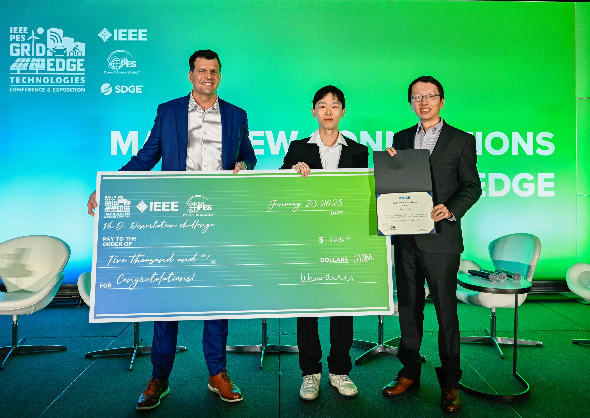

 <!-- Add your photo here -->

## Competition Information

The IEEE Power & Energy Society (PES) held its second Ph.D. Dissertation Challenge on January 23, 2025, in San Diego, USA. This prestigious **biennial** global competition, held every two years, invites doctoral students from around the world to present their dissertation research.

## Award Achievement

I was honored to receive the **Best Presentation Award** at this competition, one of only two global winners. The award includes a $5,000 prize and significant recognition in the power engineering community.

## Competition Process

The competition attracted doctoral students from universities worldwide. Twenty finalists were selected to present their research at the conference. After the final presentations and evaluations, four winners were chosen: two for "Best Research Award" and two for "Best Presentation Award." This biennial event represents the highest level of recognition for doctoral research in power and energy systems.

## Presentation Summary

My dissertation addresses the "duck curve" challenge facing power systems worldwide - the demand curve resulting from high renewable energy penetration. By improving how industrial users interact with power grids through virtual power plants (VPPs), my research offers cost-effective solutions for reshaping demand curves and securing power balance without requiring expensive redundant generation resources.

## Key Research Contributions

- **Model Efficiency**: Developed linearized models for complex industrial processes that maintain accuracy while solving 20 times faster than conventional models with integer variables
  
- **Parameter Identification**: Created innovative inverse optimization methods to accurately identify private industrial load parameters using only widely available smart meter data
  
- **Economic Optimization**: Designed co-optimization approaches for market bidding and VPP control, achieving 40% cost reduction through better coordination of industrial users and other resources
  
- **Real-World Implementation**: Successfully implemented VPP solutions with industrial partners that generates millions in annual savings

## Resources

### Competition Website
[IEEE PES Grid Edge 2025 PhD Dissertation Challenge](https://pes-gridedge.org/ge-2025/attendee/attendee-technical-program/phd-dissertation-challenge/)

### Presentation Slides
[Presentation Video on Bilibili](https://www.bilibili.com/video/BV1WaQ1YgEUf/?spm_id_from=333.1387.homepage.video_card.click)