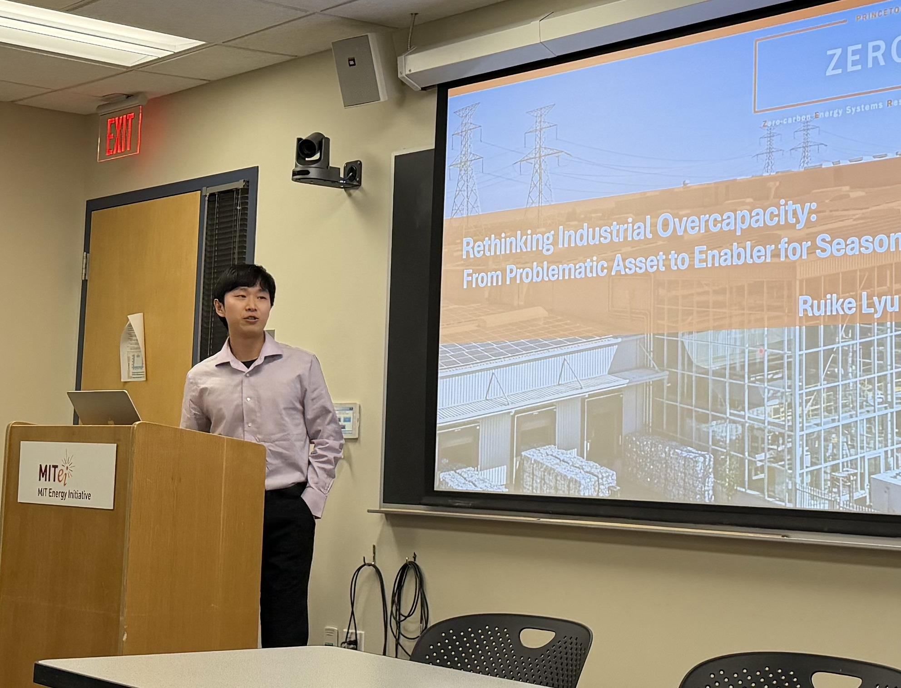
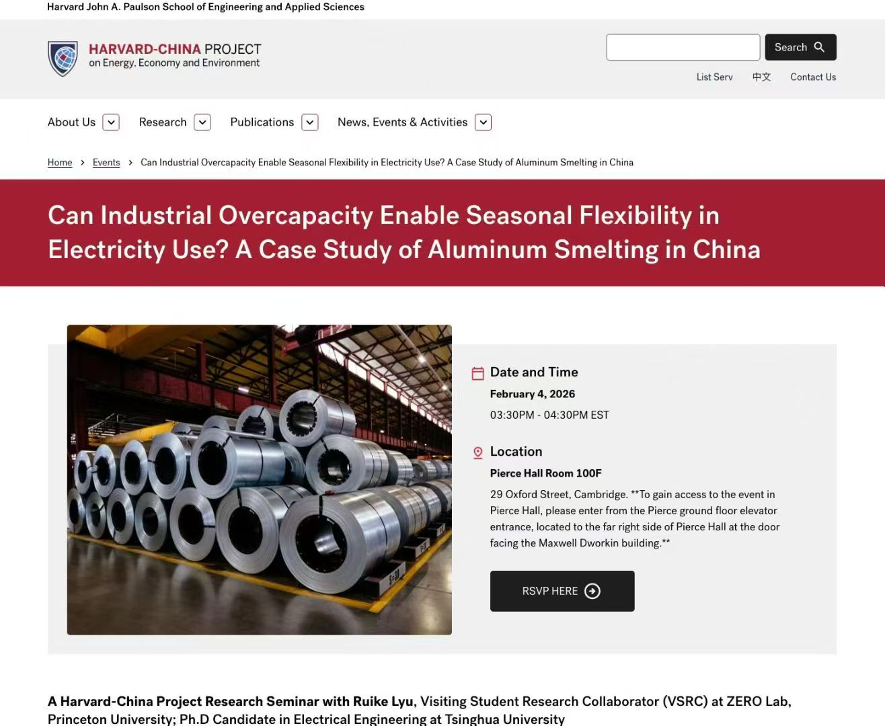

## Seminar Information

I gave this seminar at the MIT Energy Initiative on February 3, 2026. The talk presented our Nature Energy paper on how industrial overcapacity can enable seasonal flexibility in electricity use.

On February 4, 2026, I also presented the same research in a Harvard-China Project research seminar hosted at Harvard University.

The Harvard seminar was titled "Can Industrial Overcapacity Enable Seasonal Flexibility in Electricity Use? A Case Study of Aluminum Smelting in China" and was hosted by the Harvard-China Project on Energy, Economy, and Environment. The event page is available here: [Harvard Fairbank Center event page](https://fairbank.fas.harvard.edu/events/can-industrial-overcapacity-enable-seasonal-flexibility-in-electricity-use-a-case-study-of-aluminum-smelting-in-china/).

## Presentation Summary

The presentation focused on rethinking industrial overcapacity in the context of deeply decarbonized electricity systems. While overcapacity in energy-intensive industries is often considered inefficient or wasteful, our work shows that moderate overcapacity can become a valuable source of long-duration flexibility when renewable electricity is abundant but seasonal.

Using China's aluminum smelting industry as a case study, I discussed how smelters can produce more during renewable-abundant seasons, store aluminum products, and reduce production during winter peak-load periods. This seasonal operation paradigm can lower electricity system costs while also reducing industrial production costs through greater use of low-cost green electricity.

## Key Points

- Industrial overcapacity can be reframed as a flexibility resource for high-renewable power systems
- Aluminum smelters can shift production across seasons by combining spare capacity with product storage
- Seasonal operation helps address winter peak demand and renewable seasonality
- The paradigm can reduce both power system costs and aluminum production costs
- Similar ideas may inform future grid-load interaction models for other energy-intensive industries

## Related Publication

[Industrial overcapacity can enable seasonal flexibility in electricity use](https://www.nature.com/articles/s41560-026-02073-y), Nature Energy, 2026.
